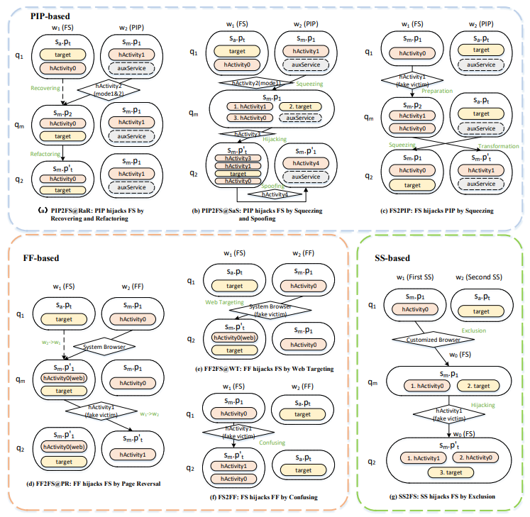

# Multi-window Hijacking
As demonstrated recently, Android's multi-window solutions can be plagued by special Activity hijacking. In these attacks, malicious applications launch phishing attacks by replacing their own `HijackingActivity` with the legitimate top Activity of the target application by means of inter-window transmissions.

The repository contains source code for seven types of Multi-window Hijacking, simulation tests on popular marketplace applications, and two recorded screens of the hijacking.

## Approach Overview

Multi-window hijacking includes 7 kinds of hijacking, 3 kinds of hijacking in `Picture-In-Picture (PIP)` mode [`PIP2FS@RaR`, `PIP2FS@SaS`, `FS2PIP`], 3 kinds of hijacking in `Freeform (FF)` mode [`FF2FS@PR`, `FF2FS@WT` , `FS2FF`], and 1 hijack in `SplitScreen(SS)` mode [`SS2FS`].

## Artifacts Elements

### Experimental Infrastructure

Here is the outline of the directory.

| .                                      |                                                              |
| -------------------------------------- | ------------------------------------------------------------ |
| +-- Data                               | Test data of the experiment                                  |
| +-- RQ2                                | Experimental data for RQ2                                    |
| +-- RQ4                                | User survey results for RQ4                                  |
| +-- Security                           | Information on multi-window hijacking                        |
| +-- Code.Phishing Hijacking            | Source code for multi-window hijacking                       |
| +-- ExitFFStack                        | Source code for FF2FS@WT                                     |
| +-- ExitSwitchFFStack                  | Source code for FF2FS@PR                                     |
| +-- FFPishing                          | Source code for FS2FF                                        |
| +-- PIPDemo                            | Source code for PIP2FS@SaS                                   |
| +-- PIPMoveStack                       | Source code for PIP2FS@RaR                                   |
| +-- PIPPishing                         | Source code for FS2PIP                                       |
| +-- SSPhishing                         | Source code for SS2FS                                        |
| +-- Screen Recording                   | Screen recording for multi-window hijacking                  |
| +-- PIPDemo-Android T Pixel 6 Pro      | Screen recording of PIP2FS@SaS running on a Pixel 6 Pro VM equipped with Android T |
| +-- PIPMoveStack-Android T-Pixel 6 Pro | Screen recording of PIP2FS@RaR running on a Pixel 6 Pro VM equipped with Android T |

### Source Code

The code stored in this repository can be run on both real devices and virtual machines running Android 12 (Android S)/Android 13 (Android T) and supporting multi-window solutions.

#### PIP2FS@RaR

Here is the outline of the directory.

| .app/src/main/java/com/example/pipmovestack |                                                         |
| ------------------------------------------- | ------------------------------------------------------- |
| +-- MonitorList.java                        | List of monitoring target activities                    |
| +-- MonitorService.java                     | Service for monitoring                                  |
| +-- VideoActivity.java                      | Activity used for video playback and also for hijacking |

#### PIP2FS@SaS

Here is the outline of the directory.

| .app/src/main/java/com/example/pipdemo |                                             |
| -------------------------------------- | ------------------------------------------- |
| +-- AnotherVideoActivity.java          | the second Activity used for video playback |
| +-- HijackActivity.java                | Activity used for hijacking                 |
| +-- MonitorList.java                   | List of monitoring target activities        |
| +-- MonitorService.java                | Service for monitoring                      |
| +-- VideoActivity.java                 | Activity used for video playback            |

#### FS2PIP

Here is the outline of the directory.

| .app/src/main/java/com/example/pippishing |                                                |
| ----------------------------------------- | ---------------------------------------------- |
| +-- HijackActivity.java                   | Activity used for hijacking                    |
| +-- MainActivity.java                     | Activity that disguises itself as a normal app |

#### FF2FS@WT

Here is the outline of the directory.

| .app/src/main/java/com/example/exitffstack |                                                              |
| ------------------------------------------ | ------------------------------------------------------------ |
| +-- MainActivity.java                      | The activity that disguises itself as a normal app and can open hijacked web page |
| +-- MonitorList.java                       | List of monitoring target activities                         |

#### FF2FS@PR

Here is the outline of the directory.

| .app/src/main/java/com/example/exitswitchffstack |                                                              |
| ------------------------------------------------ | ------------------------------------------------------------ |
| +-- HijackActivity.java                          | Activity used for hijacking                                  |
| +-- MainActivity.java                            | Activity that disguises itself as a normal app and can open hijacked web page |
| +-- MonitorList.java                             | List of monitoring target activities                         |

#### FS2FF

Here is the outline of the directory.

| .app/src/main/java/com/example/ffpishing |                                                |
| ---------------------------------------- | ---------------------------------------------- |
| +-- HijackActivity.java                  | Activity used for hijacking                    |
| +-- MainActivity.java                    | Activity that disguises itself as a normal app |
| +-- MonitorList.java                     | List of monitoring target activities           |

#### SS2FS

Here is the outline of the directory.

| .app/src/main/java/com/example/ssphishing |                                                |
| ----------------------------------------- | ---------------------------------------------- |
| +-- MainActivity.java                     | Activity that disguises itself as a normal app |
| +-- Monitorlist.java                      | List of monitoring target activities           |
| +-- PhishingActivity.java                 | Activity used for hijacking                    |

## Evaluation

### Evaluation Subjects

Our RQ2 experiments involved popular market applications, tested on real/virtual devices running Android 12 (Android S)/Android 13 (Android T). The popular market apps we tested included five categories (banking software, financial software, storage software, video software, shopping software). Starting from September 9, 2022, we collected 274 apps with over one million downloads from four widely used app markets in China (`Tencent App Store`, `Huawei App Gallery`, `Vivo App Store`, and `Xiaomi App Store`).

In the `Hijacked Page` tab, we included the names, categories, target Activity names, purposes of the 274 applications, and whether the app supports FF and SS modes. In the remaining 6 tabs corresponding to hijacks other than `FS2PIP`, there are test results for 233 popular apps (excluding video software) along with notes on the testing conditions (symptoms of failure and situations where there were prompts but the operation was successful). In the `FS2PIP` tab, there are 41 video software app names, whether they support PIP mode, target Activity names, test results, and notes. In the `Defence Test` tab, it includes whether all apps have defense strategies, the classification of defense strategies, and experimental data explanations.

Our RQ4 survey included 231 undergraduate students and teachers with a background in computer science, and we also uploaded our survey questionnaire template. For our developer email survey, we contacted 12 development teams or security teams of popular market applications. Due to privacy and security concerns, we did not upload their responses but only submitted our email templates.

The `Deception of hijacking`, `Security Analysis`, `Details` tabs contain data consistent with what is mentioned in our paper. In the `FeedBacks` tab, there are 63 user feedback on the security of multi-window solutions as mentioned in our paper.

## Notes

- This implementation has been tested with two real devices. **Device1:** Vivo IQOO 10 with OriginOS 13.2 of Android 13 (API 33), 512G storage, Snapdragon 8 plus with 8-core CPU and 12 + 8G memory. **Device2:** Oppo Reno Ace with ColorOS 12.1 of Android 12 (API 31), 512G storage, Snapdragon 855 plus with 8-core CPU and 12 + 8G memory. 
